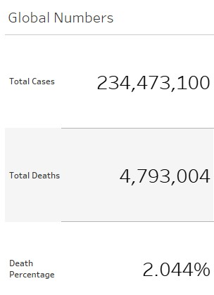
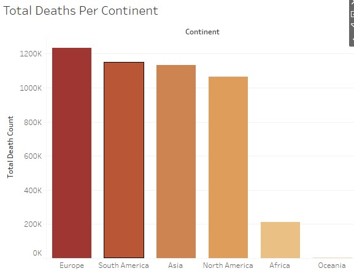
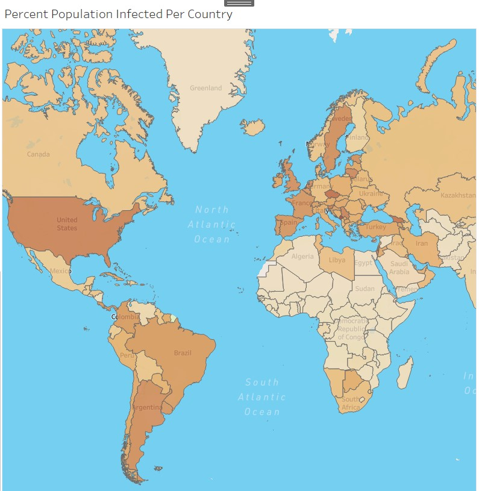
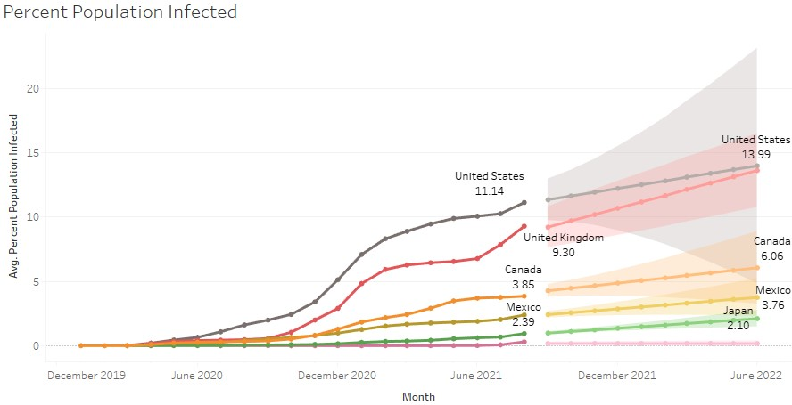

# Covid-19 Data Exploration in SQL & Dashboard Visualization in Tableau Public: Project Overview

- Explored Covid-19 data by aggregating to identify trends in preperation for dashboard visualization in Tableau Public
- Uncovered death and infection rates by country, continent, and world
- Discovered which countries had the highest death and infection rates as well as the highest death and infection countries
- **View Final Tableau Visual Here:** [Dashboard Page](https://public.tableau.com/app/profile/will.nguyen/viz/Covid-19Visualization_16336779056520/Dashboard1)

## Code and Resources Used

**Microsoft Excel Version:** Office 365 Version 18.2110.13110.0

**Microsoft SQL Server 2019 Version:** 15.0.4153.1  

**Skills Used:** Aggregate Functions, Converting Data Types, Creating Views, Joins, Temp Tables, Windows Functions  

**Tableau Public Version:** 2021.3  

**YouTube Video Project Guides**: [SQL Exploration](https://www.youtube.com/watch?v=qfyynHBFOsM), [Tableau Visualization](https://www.youtube.com/watch?v=QILNlRvJlfQ&list=PLUaB-1hjhk8H48Pj32z4GZgGWyylqv85f&index=2), [Author: Alex the Analyst](https://www.youtube.com/channel/UC7cs8q-gJRlGwj4A8OmCmXg) 

**Data Source (Oct 2021)**: [Our World in Data: Coronavirus (COVID-19) Deaths](https://ourworldindata.org/covid-deaths)  

## Data Preparation in Microsoft Excel

- After retrieving data from "Our World in Data," load into Microsoft Excel and separate into 2 separate .xlsx files.
    - CovidDeaths.xlsx (includes infection cases)
    - CovidVaccinations.xlsx
- These two .xlsx files are included in this repo.

## SQL Queries Used for Dashboard Visualization
Paste the output of each individual query into their own .xlsx file.  
-  Should end up with total of 4 .xlsx files with each file representing an individual component of the dashboard.

**Global Numbers for Total Cases, Total Deaths, Death Percentage:**  

    SELECT SUM(new_cases) total_cases, SUM(CONVERT(INT, new_deaths)) total_deaths, 
           SUM(CONVERT(INT, new_deaths))/SUM(new_cases)*100 death_percentage
      FROM PortfolioProject..CovidDeaths
     WHERE continent IS NOT NULL

**Total Deaths Per Continent for Bar Chart:**

    SELECT location, SUM(CONVERT(INT, new_deaths)) total_death_count
      FROM PortfolioProject..CovidDeaths
     WHERE continent IS NULL AND location NOT IN ('World', 'European Union', 'International')
     GROUP BY location
     ORDER BY total_death_count DESC

**Percent Population Infected Per Country for Map Visualization:**

    SELECT location, MAX(total_cases) highest_infection_count, population,
           MAX((total_cases/population))*100 percent_population_infected
      FROM PortfolioProject..CovidDeaths
     GROUP BY location, population
     ORDER BY percent_population_infected DESC

**Percent Population Infected Over Time of Selected Countries for Time Series Line Chart:**

    SELECT location, date, MAX(total_cases) highest_infection_count, 
           population, MAX((total_cases/population))*100 percent_population_infected
      FROM PortfolioProject..CovidDeaths
     GROUP BY Location, Population, date
     ORDER BY percent_population_infected DESC

